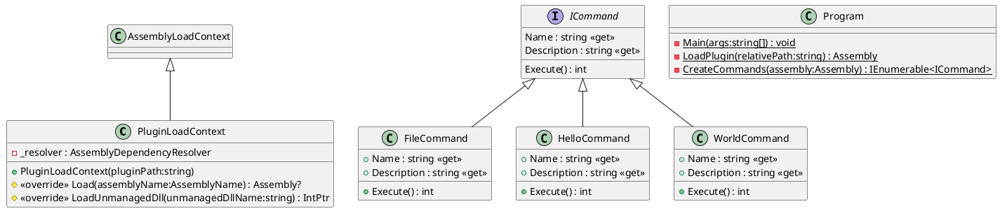

# App with Plugin

Link : https://learn.microsoft.com/en-us/dotnet/core/tutorials/creating-app-with-plugin-support

```plantuml
@startuml
class PluginLoadContext {
    - _resolver : AssemblyDependencyResolver
    + PluginLoadContext(pluginPath:string)
    # <<override>> Load(assemblyName:AssemblyName) : Assembly?
    # <<override>> LoadUnmanagedDll(unmanagedDllName:string) : IntPtr
}
AssemblyLoadContext <|-- PluginLoadContext

class FileCommand {
    + Name : string <<get>>
    + Description : string <<get>>
    + Execute() : int
}
ICommand <|-- FileCommand

class HelloCommand {
    + Name : string <<get>>
    + Description : string <<get>>
    + Execute() : int
}
ICommand <|-- HelloCommand

class WorldCommand {
    + Name : string <<get>>
    + Description : string <<get>>
    + Execute() : int
}
ICommand <|-- WorldCommand

interface ICommand {
    Name : string <<get>>
    Description : string <<get>>
    Execute() : int
}

class Program {
    - {static} Main(args:string[]) : void
    {static} - LoadPlugin(relativePath:string) : Assembly
    {static} - CreateCommands(assembly:Assembly) : IEnumerable<ICommand>
}
@enduml
```
